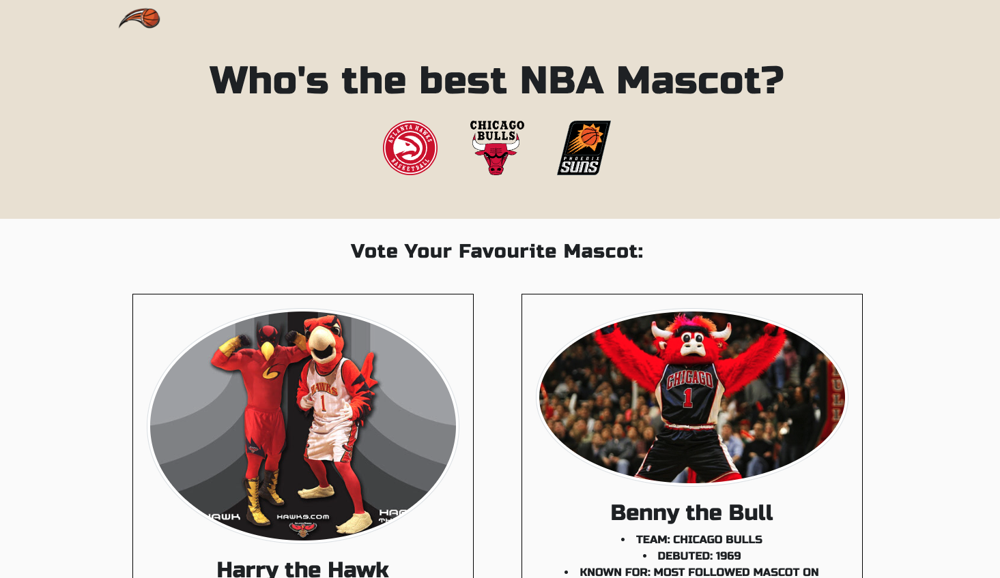

# Voting-website
This is a simple web application that allows users to vote for their favorite NBA mascot among three different options: Harry, Benny and Hugo. The application stores the vote data using the browser's local storage and displays the results on a separate page.
## Features:
* Easy to use interface with clear instructions

* Simple and fast voting system that stores data in local storage

* Create random GIF from Giphy

* Read game Stats
## Usage:
To use the voting system, simply open the "index.html" file in your browser to access the voting page. From there, select your favorite option and click the "Vote" button. You can also click the "Show Results" button to view the voting results.

Once you have voted, your selection will be stored in the browser's local storage. This means that you can close the browser and come back later to see the current results. With the addition create GIF function to interact with user, as well as NBA game stats data.
## Technology:
The application is built using HTML, CSS, Bootstrap, JavaScript and Jquery with Giphy API and NBA API.
## Screenshot:

## Deployed URL:
https://apeachcc.github.io/Voting-website/

## Slide:
https://docs.google.com/presentation/d/e/2PACX-1vRALQV97xDjOrAneurDK1Ke256MTH8PtDMswPIO0elQloxIh-FiRriX7BnOp0vrUlCbq_5C3hY1Phnz/pub?start=false&loop=false&delayms=3000&slide=id.p
